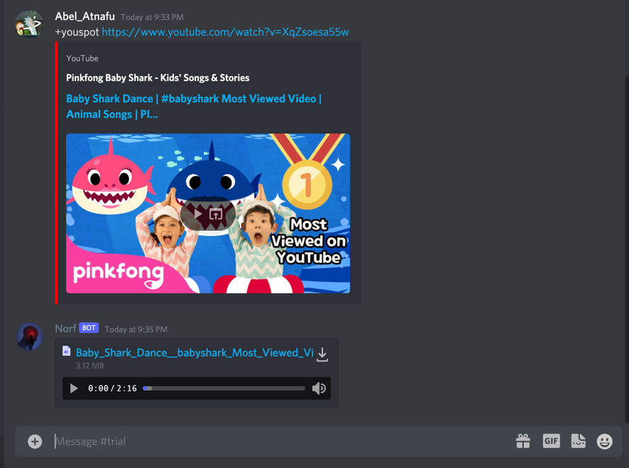

A discord bot that gets triggered by +youspot and takes in a youtube link then downloads the song and places it into my spotify local files and also send it to the server if the file is less that the discord limit.

